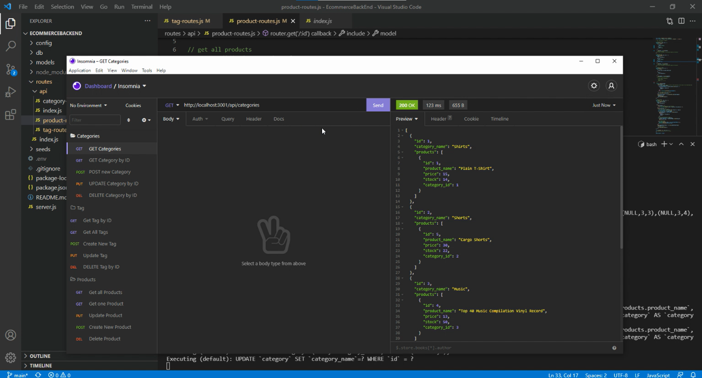

# EcommerceBackEnd

## **Project Summary** ⚡️

_As a manaer to an internet retail company, I want back end for my e-commerce website that uses the lastes tech so that my company
can compete with other e-commerce companies._

__________________________________________________________________________________________________________________________________________________

## **Tools Used** 🛠️

* MYSQL2
* npm
* Sequelize
* dotenv
* node.js
* express.js
* Workbench
* Insomnia

___________________________________________________________________________________________________________________________________________________

## **Steps**📋

This application requires Node.js, Express.js, and Sequelize. To connect to the database run mysql -u root -p and enter password from .env file. Then source the schema.sql. To seed the file run npm run seed. Finally to connect to the server run npm start.

___________________________________________________________________________________________________________________________________________________

## **Website** 📷

___________________________________________________________________________________________________________________________________________________

# 📷 Video

[Live video Demo](https://youtu.be/wsDYbmsMo5A)

___________________________________________________________________________________________________________________________________________________

## **Recourses** 💡

[Katherine Y : Github](https://github.com/katherineyoguez/EcommerceBackEnd)

____________________________________________________________________________________________________________________